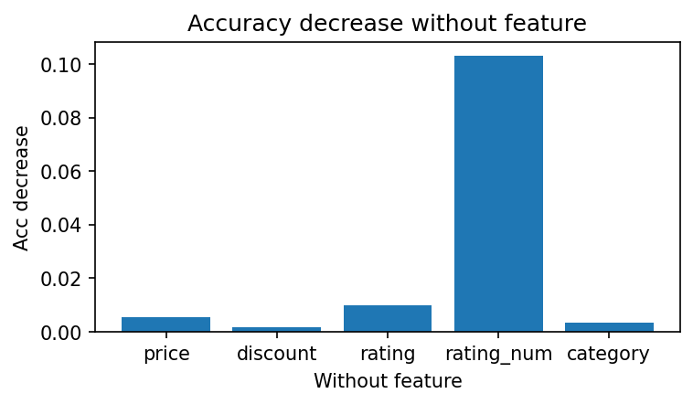
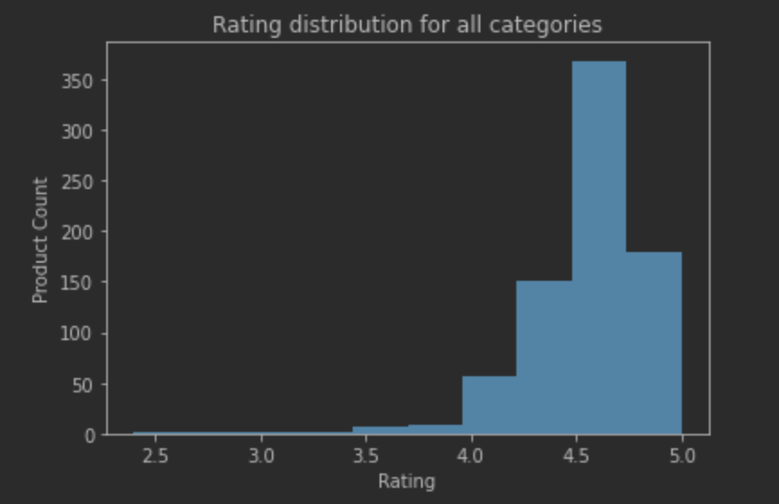
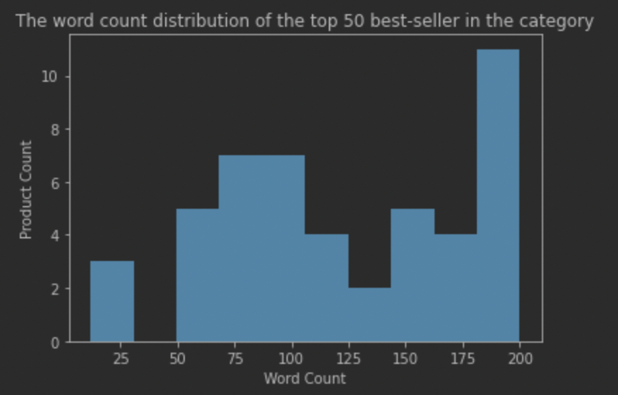

# Analysis Report

## Machine Learning Component
### Introduction

Our goal is to predict whether a product will be a top-seller. We define top sellers as top 50 products in the list. Therefore it is a binary classification problem.  We use Logistics Regression as our machine learning model. We use 70% of data for training and validation, and 30% data for testing. We use K-fold cross validation to find the best hyper parameters, and the number of fold is 5. 

Since the dataset size is relatively small，test accuracy is highly dependent on train/test dataset spliting. Therefore we test or validate for multiple times and then take the average accuracy. Specifically,  we repeat K-fold validation for 100 times to compute the average validation accuracy. We repeat test for 300 times to compute the average test accuracy.

### Experiment Details
**Experiemnt 1**

In this experiemnt, we use K-fold cross validation to find the best hyper parameters and test it's accuracy. We try out different regularization methods (l1 and l2) and different regularization parameters $C$ (from 0.1 to 1.0). 
The following image is Validation Accuracy across different $C$.

We can see the best parameter is $C=0.1$ with l1 regularization. Also we can see l1 regularization out-performs l2 regularization in all the settings.

We also conduct experiments on model with default parameters:

|                    |    train acc   |     test acc      |
|--------------------|----------------|-------------------|
| best parameter     | 0.586          | 0.570             |
| default parameter  | 0.567          | 0.556             |

We get about 2 percent accuracy improvement using K-fold cv parameter searching.

**Experiemnt 2**

In this experiment, we explore how different scale methods influence the experiment results. We try out two different scale methods: Standard normalization and MinMax normalize. And the results is shown below:

|           | train acc      | test acc          |
|-----------|----------------|-------------------|
| MinMax    | 0.579          | 0.510             |
| Standard  | 0.578          | 0.567             |

We can see both normalization methods make the test accuracy drops compared with unnormalized one. Whiles standard normalization has little influence, while minmax decrease the accuracy by 6 percents. By probing the data, we find that the value range is relatively large and minmax normalization will squeeze the small values to zeros, which may make the prediction much harder.
Example data entry before and after minmax normalization is shown below:

Before: $[118.32,  0.00, 4.50, 62.00]$

After: $[2.6e^{-4}, 0.00, 0.80, 6.9e^{-5}]$

**Experiemnt 3**

In this experiment, we explore how different data features influence the experiment results.
We disable a feature in the dataset once a time and do K-fold cross validation to find the best hyper parameters under such setting. Then we compute how will the final accuracy drop if the model is not trained with certain feature. The following image is accuracy decrease without different features:

We can see the most influential feature is rating number, while the other features has lower influence. 

### Questions in Handout
*  **Did you have to clean or restructure your data?**
    * Yes. Some of our data contains N/A property. Therefore we should drop these rows.
    * We also use onehot encoding to transfer categorical variable into numerical. 
    
*  **Why did you use this statistical test or ML algorithm?**
    * Our goal is to predict whether a product will be a top-seller. We define top sellers as top 50 products in the list. Therefore it is a binary classification problem. 
    * Since we have a label for each product (is top-seller or not), we should use supervised learning paradigm.
    * Our dataset size is relatively small (less than 800 data points), therefore we should avoid using complicated models such as Deep Learning which may easily overfit the dataset.
    * In short, we should choose a *simple*, *supervised* machine learning model for a *binary classification* problem. Therefore Logistics Regression is a great choice.
    
*  **Which other tests did you consider or evaluate?**
    * Besides normal accuracy test, we also conduct experiments to explore: (1) how different scale method influence the experiment results, (2) explore how different features influence the experiment results
    
*  **How did you measure success or failure?**
    * We measure success by evaluating if the model can predict a product in the testset is top-seller or not correctly.
    * Specifically, we use accuracy in our experiment.
    
*  **Why that metric/value?** & **For prediction projects, we expect you to argue why you got the accuracy/success metric you have.**
    * In our definition, top-seller products defined as top 50 products is labeled positive, and the rest 50 products is labeled negative. 
    * Since the label classes is balanced, and it's a classification task, accuracy is a great choice.
    
*  **What challenges did you face evaluating the model?**
    * Since we are trying to explore the how the model performance is influenced by different hyper-parameters and features, we find it hard to structure the code to run these experiments in a orgnized way. 
    * Also since our dataset is relatively small, the test accuracy may vary from time to time. Therefore we choose to repeat test for multiple times and then compute the average accuracy.
    
*  **What is your interpretation of the results?**
    * Our best test accuracy is 57%, which means we can predict the label correctly about 57 times out of 100 trials. We also compute the confusion matrix as below:

    |                     |   real negative    |     real positive    |
    |---------------------|--------------------|----------------------|
    |  predicted negative |        79          |       23             |
    |  predicted positive |        55          |       37             |

    And we can see, the false positive rate is high, which means the model prones to classify a non-top-seller product as a top-seller product.

*  **Are you satisfied with your prediction accuracy?**
    * At first we got 55% accuracy, and we are not satisfied with it. Since this is a binary classification problem, 55% accuracy is just a little better than random guess. Consider a real world scenario, a amazon seller may want to use the model to predict whether a product will be popular, and 55% is not a satisfying accuracy.

*  **Intuitively, how do you react to the results? Are you confident in the results?**
<<<<<<< HEAD
    * Since we are not quite satisfied with the prediction accuracy at first,  we use grid search to find the best hyper parameters and gain 2 percents (from 55% to 57%) accuracy improvement. 
    * We review our codes and experiments carefully, therefore we are confident in the results.
=======
    * Since we are not quite satisfied with the prediction accuracy at first,  we use grid search to find the best hyper parameters and gain 2 percents (from 55% to 57%) accuracy improvement. We are confident in the results.
    
## Hypothesis Testing Component
### Introduction

In this component, we are to test the factors that might have impact on being a best seller and do testing on some interesting facts in the data. The data is defined that the top 50 sellers are the best sellers. Therefore, we mainly focus on the the comparison between the top 50 and the others/the overall.

### Experiment Details
**Hypothesis Testing 1**

In this test, we tested the hypothesis:

H0: The ratings of category 'Baby' shows no difference from the ratings of the others.

H1: The ratings of category 'Baby' shows a significant difference from the ratings of the others.

The reason why we have these hypothesis is that we found that the distribution of rating of the baby's category is significantly different from the rating of all the categories and the average rating of the baby's category is higher. Then we assume that the product tend to be of better quality for baby.  

We can reject the null hypothesis since alpha = 0.05 and the test stats is 5.98191204258953, which is positive and indicates that the rejection region is on the right, so we have the corresponding value in z-table as 1.960, which is less than 5.98191204258953.

Therefore, we can say the products which are in the ‘Baby’ category are of higher quality, these sellers tend to have more quality control in this area compare with the overall rating distribution of all the categories.

**Hypothesis Testing 2**

In this test,we tested the hypothesis:

H0: The length of the product title of the electronic category is irrelavant to being best seller.

H1: The length of the product title of the electronic category is relavant to being best seller.

As shown in the figures below, the title length of the electronics goes up as the rank in the category goes higher. Then we think the longer description might be more attractive to the customers.

As the result, we cannot reject the null hypothesis since degree of freedom is 90.999513442532 and the test stats is -1.4526947546293916, which is negative and indicates that the rejection region is on the left, so we have the corresponding value in t-table as -1.987, which is less than -1.4526947546293916.

Therefore, we can say that of 95% chance the length of the name is irrelavant to being the best seller. In other words, how long do the sellers descript the products won’t have impact on being best sellers.

**Hypothesis Testing 3**

In this test, we tested the hypothesis:

H0: The number of rating count and being a best seller are independent.

H1: There is an association between the number of rating count and being a best seller.

Since Amazon always top the best sellers' product and stastically the rating count of the best sellers' items seems higher than the normal sellers' and the number of the ratings indicates how many people buy the product. We think probably there is a relationship between the ratings count and being the best seller.

The ratings count in each category of top 50 sellers:

| Category  | Ratings Count  |
|:----------|:----------|
Baby|1468092.0
Camera & Photo Products|397632.0
Electronics|4368936.0
Industrial & Scientific|1173969.0
Kitchen & Dining|1954847.0
Magazine Subscriptions|354759.0
Office Products|1897105.0
Sports Collectibles|14338.0

The ratings count in each category of all the sellers:

| Category  | Ratings Count  |
|:----------|:----------|
Baby|2412915.0
Camera & Photo Products|727130.0
Electronics|6005474.0
Industrial & Scientific|1994542.0
Kitchen & Dining|3269180.0
Magazine Subscriptions|504523.0
Office Products|3005608.0
Sports Collectibles|19801.0

Ratio of each category of the tables above:

| Category  | Ratio (top50_counts/all_counts)  |
|:----------|:----------|
|Baby|0.608431
|Camera & Photo Products|0.546851
|Electronics|0.727492
|Industrial & Scientific|0.588591
|Kitchen & Dining|0.597962
|Magazine Subscriptions|0.703157
|Office Products|0.631188
|Sports Collectibles|0.724105

We can see that the ratio varies among categories. So we can assume that in different categories, the ratings count has different association with being best sellers to some extent.

As the result, We can reject the null hypothesis since according to the chi-square table, alpha = 0.05 and the number of category is 8, which means that df = 7, we have the critical value is 14.067, and this value is less than the chi_square stats.
Actually even when a;pha = 0.05, the critical value is 20.278, which is still less than the stats, so we can say that it is of 99.5% chance that there is an association between the number of rating count and being a best seller.

### Questions in Handout
*  **Why did you use this statistical test or ML algorithm?**
    * In hypothesis testing, we decide to use t-test, z-test and chi-square goodness of fit test to analysis the data.
    * We test the facts that might influence the being of best seller. In the analysis, we test the relationship between the length of the product name and being best seller and the relationship between the number of rating count and being best seller.
    * Given the fact that we set the top 50 sellers as the best seller, we conduct the analysis and do the comparison between the top 50 and the others or the top 50 and the whole population.
    
*  **Which other tests did you consider or evaluate?**
    * We also test the relationship between the products in baby's category and all the products. The details, including the reason why we find this analysis is interesting, are in the hypothesis testing 1.
    
*  **How did you measure success or failure?**
    * In general view, since ypothesis testing is a statistical inference method used to judge whether the differences between samples and samples and between samples and the population are caused by sampling error or essential differences, it is hard to say whethere it is successful or not, we just use it as a method to test our hypothesis. 
    * However, in the testing, we follow the testing methods, for instance, we check t-table for t-test and based on the test stats, alpha, etc. and decide whether to reject the null hypothesis or not.
    
*  **What is your interpretation of the results?**
    * The interpretations of the results are discussed above in hypothesis testing 1, 2 & 3.

*  **Intuitively, how do you react to the results? Are you confident in the results?**
    * The test 1 and 3 really don't surprise us and we are quite confident in the results, since the charts and figures are really obvious to make the hypothesis, and the stats in the results support our hypothesis. 
    * The test 2 really beyond our expectation since we think the more description for the product might leads to the more attractions to potential buyers.
>>>>>>> 2889da4dc810ba700522fe92b57f1270c85c9e83
