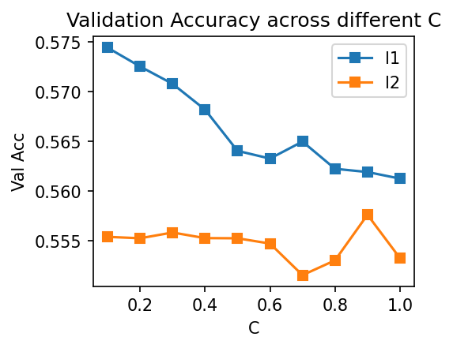

# Analysis Report

## Machine Learning Component
### Introduction

Our goal is to predict whether a product will be a top-seller. We define top sellers as top 50 products in the list. Therefore it is a binary classification problem.  We use Logistics Regression as our machine learning model. We use 70% of data for training and validation, and 30% data for testing. We use K-fold cross validation to find the best hyper parameters, and the number of fold is 5. 

Since the dataset size is relatively small，test accuracy is highly dependent on train/test dataset spliting. Therefore we test or validate for multiple times and then take the average accuracy. Specifically,  we repeat K-fold validation for 100 times to compute the average validation accuracy. We repeat test for 300 times to compute the average test accuracy.

### Experiment Details
**Experiemnt 1**

In this experiemnt, we use K-fold cross validation to find the best hyper parameters and test it's accuracy. We try out different regularization methods (l1 and l2) and different regularization parameters $C$ (from 0.1 to 1.0). 
The following image is Validation Accuracy across different $C$.

We can see the best parameter is $C=0.1$ with l1 regularization. Also we can see l1 regularization out-performs l2 regularization in all the settings.

We also conduct experiments on model with default parameters:

|                    |    train acc   |     test acc      |
|--------------------|----------------|-------------------|
| best parameter     | 0.586          | 0.570             |
| default parameter  | 0.567          | 0.556             |

We get about 2 percent accuracy improvement using K-fold cv parameter searching.

**Experiemnt 2**

In this experiment, we explore how different scale methods influence the experiment results. We try out two different scale methods: Standard normalization and MinMax normalize. And the results is shown below:

|           | train acc      | test acc          |
|-----------|----------------|-------------------|
| MinMax    | 0.579          | 0.510             |
| Standard  | 0.578          | 0.567             |

We can see both normalization methods make the test accuracy drops compared with unnormalized one. Whiles standard normalization has little influence, while minmax decrease the accuracy by 6 percents. By probing the data, we find that the value range is relatively large and minmax normalization will squeeze the small values to zeros, which may make the prediction much harder.
Example data entry before and after minmax normalization is shown below:

Before: $[118.32,  0.00, 4.50, 62.00]$

After: $[2.6e^{-4}, 0.00, 0.80, 6.9e^{-5}]$

**Experiemnt 3**

In this experiment, we explore how different data features influence the experiment results.
We disable a feature in the dataset once a time and do K-fold cross validation to find the best hyper parameters under such setting. Then we compute how will the final accuracy drop if the model is not trained with certain feature. The following image is accuracy decrease without different features:

We can see the most influential feature is rating number, while the other features has lower influence. 

### Questions in Handout
*  **Did you have to clean or restructure your data?**
    * Yes. Some of our data contains N/A property. Therefore we should drop these rows.
    * We also use onehot encoding to transfer categorical variable into numerical. 
    
*  **Why did you use this statistical test or ML algorithm?**
    * Our goal is to predict whether a product will be a top-seller. We define top sellers as top 50 products in the list. Therefore it is a binary classification problem. 
    * Since we have a label for each product (is top-seller or not), we should use supervised learning paradigm.
    * Our dataset size is relatively small (less than 800 data points), therefore we should avoid using complicated models such as Deep Learning which may easily overfit the dataset.
    * In short, we should choose a *simple*, *supervised* machine learning model for a *binary classification* problem. Therefore Logistics Regression is a great choice.
    
*  **Which other tests did you consider or evaluate?**
    * Besides normal accuracy test, we also conduct experiments to explore: (1) how different scale method influence the experiment results, (2) explore how different features influence the experiment results
    
*  **How did you measure success or failure?**
    * We measure success by evaluating if the model can predict a product in the testset is top-seller or not correctly.
    * Specifically, we use accuracy in our experiment.
    
*  **Why that metric/value?** & **For prediction projects, we expect you to argue why you got the accuracy/success metric you have.**
    * In our definition, top-seller products defined as top 50 products is labeled positive, and the rest 50 products is labeled negative. 
    * Since the label classes is balanced, and it's a classification task, accuracy is a great choice.
    
*  **What challenges did you face evaluating the model?**
    * Since we are trying to explore the how the model performance is influenced by different hyper-parameters and features, we find it hard to structure the code to run these experiments in a orgnized way. 
    * Also since our dataset is relatively small, the test accuracy may vary from time to time. Therefore we choose to repeat test for multiple times and then compute the average accuracy.
    
*  **What is your interpretation of the results?**
    * Our best test accuracy is 57%, which means we can predict the label correctly about 57 times out of 100 trials. We also compute the confusion matrix as below:

    |                     |   real negative    |     real positive    |
    |---------------------|--------------------|----------------------|
    |  predicted negative |        79          |       23             |
    |  predicted positive |        55          |       37             |

    And we can see, the false positive rate is high, which means the model prones to classify a non-top-seller product as a top-seller product.

*  **Are you satisfied with your prediction accuracy?**
    * At first we got 55% accuracy, and we are not satisfied with it. Since this is a binary classification problem, 55% accuracy is just a little better than random guess. Consider a real world scenario, a amazon seller may want to use the model to predict whether a product will be popular, and 55% is not a satisfying accuracy.

*  **Intuitively, how do you react to the results? Are you confident in the results?**
    * Since we are not quite satisfied with the prediction accuracy at first,  we use grid search to find the best hyper parameters and gain 2 percents (from 55% to 57%) accuracy improvement. 
    * We review our codes and experiments carefully, therefore we are confident in the results.