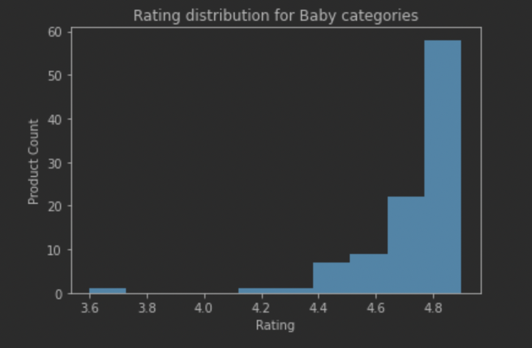
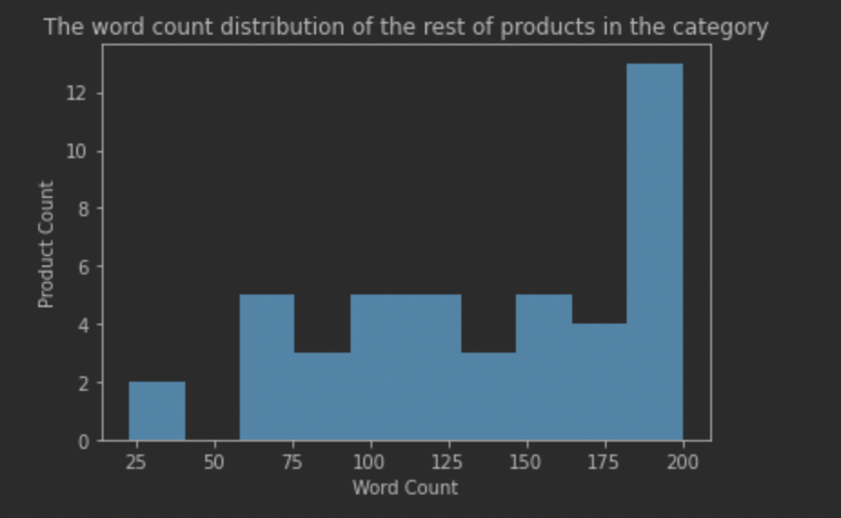

## Visualization Components in Machine Learning

### Usage and why pick this graph:

In this part, we used a total of three graphs to visualize the data. 

|  |  |  |
| ------------------------- | -------------------------------- | -------------------------- |
| Figure 1                  | Figure 2                         | Figure 3                   |

#### Figure 1: 

In the first experiment in the machine learning model, we are trying to K-fold cross validation to find the best hyper parameters and test their accuracy. In this experiment, we used different regularization parameters to test the difference in results, because the regularization parameters range from 0.1 to 1, so we want to show that the results change as the variable grows. At the same time, on the basis that the parameter will change, we also intend to use different methods, so we need to display the results of the two regularization methods corresponding to the same variable at the same time. According to the above requirements, the most suitable for our situation is the line chart, which is why we chose it. 

#### Figure 2:

Due to the peculiarity of our project, we applied this machine learning model to eight categories simultaneously to examine how the same set of tuning parameters differs in the prediction results of different categories. Because our model's prediction will be a binary classification, we want the graph to show the failure rate (error rate) of the prediction results for different categories of products in the overall ratio. Therefore, a pie chart is the best graph to show this result.

#### Figure 3:

In our third experiment, we wanted to understand how important each of these attributes of a product was to the prediction accuracy. In order to achieve this goal, we will deliberately ignore certain parameters in each training to see the accuracy of the final result. Considering that bar charts provide a visual presentation of categorical data, we decided to use it to visualize our results.

### What alternative ways might you communicate the result?

We deeply understand that each type of chart has different functions, so we are confident that the chart used is the most suitable one. If we had to choose an alternative, I think Figures 1 and 2 could also be represented by bar graphs, but it wouldn't be as intuitive as the current choice.

### Were there any challenges visualizing the results, and if so, what were they? 

We didn't encounter too many challenges, it was because our project was a machine learning project rather than a statistical data project, that is, we are showing results instead of unprocessed raw data.  This keeps our visualizations from facing too many challenges.

### Will your visualization require text to provide context or is it standalone？

Although we have labeled each chart in detail, considering that these charts are attached to machine learning projects, readers may not fully understand what it shows without context.

## Visualization Components in Hypothesis Testing

### Usage and why pick this graph:

In this part, we used a total of four graphs to visualize the data. 

|  |    |
| ----------------------------- | ---------------------------- |
|    |  |

Considering that in this Hypothesis Testing, we want to show the distribution of the value of a certain research object in all the data, so we choose histograms (that are very suitable for showing the distribution) to present them. Initially, we intended to use bar charts as the first choice for presenting data, but we then realized that histograms give a rough sense of the density of the underlying distribution of the data which are suitable for our case.

### What alternative ways might you communicate the result?

Like I said before, histograms are the best option, but given the similarity between the two, we think bar chart graphs could also be an alternative.

### Were there any challenges visualizing the results, and if so, what were they? 

We did not encounter any big challenges visualizing the results in this part. This is because we were trying to use simple and intuitive data for the hypothesis testing, so as to avoid introducing unnecessary factors for readers. 

### Will your visualization require text to provide context or is it standalone？

We are doing our best to make the charts easier to understand. To achieve this, we carefully label each chart with horizontal and vertical axis. On top of this, we've also added titles, which makes it easy to see where the results of the graphs apply.